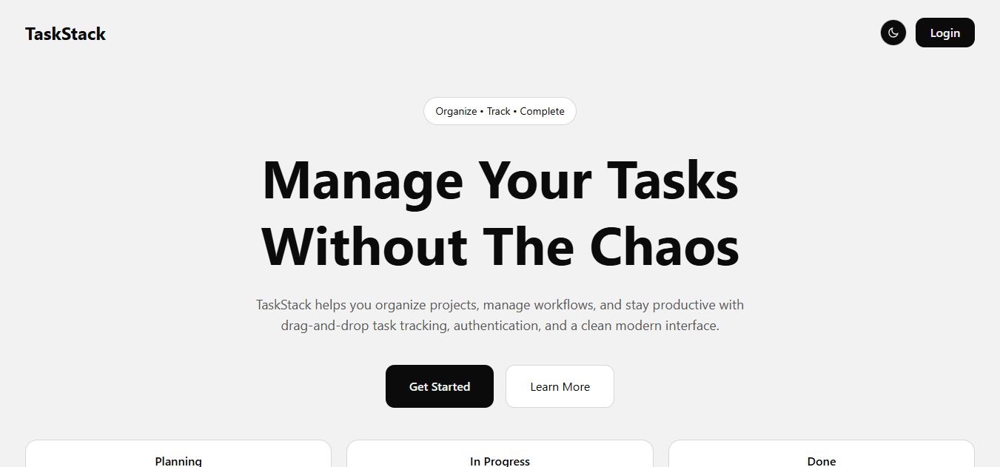
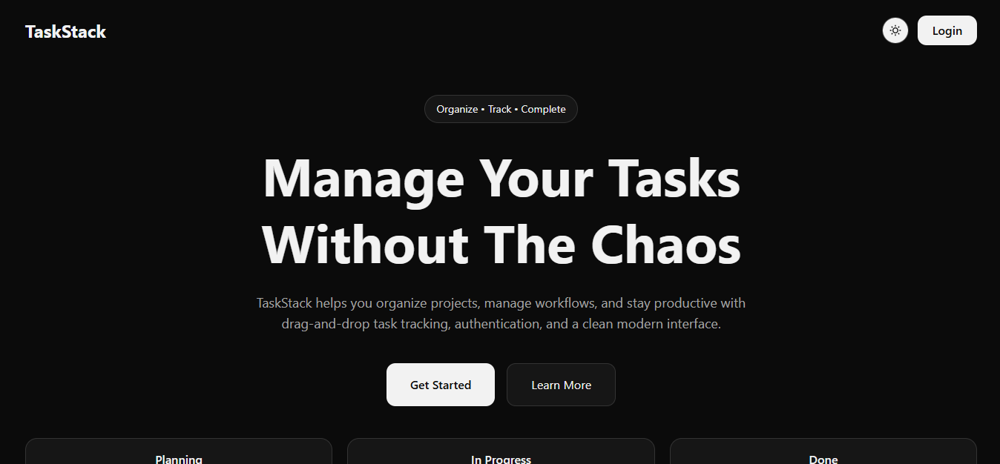
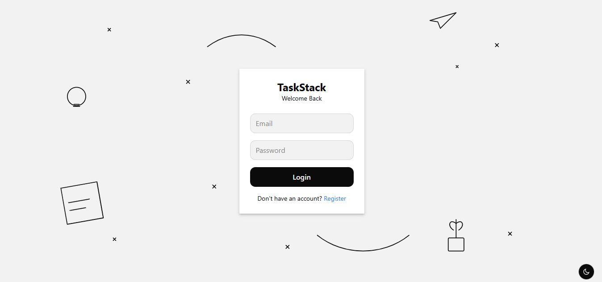
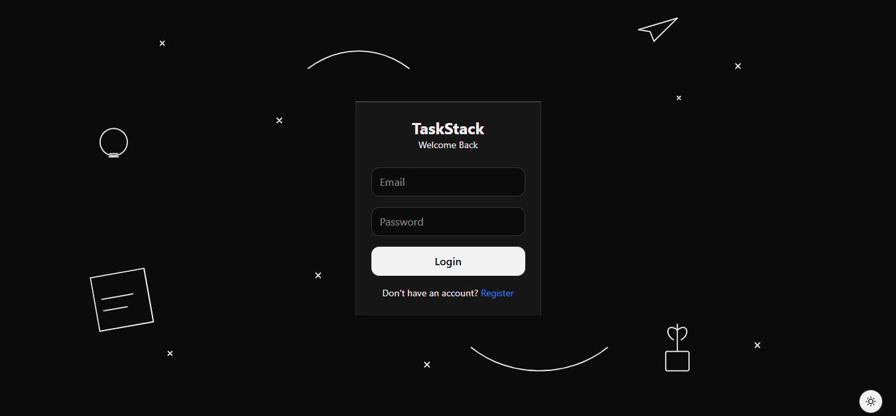
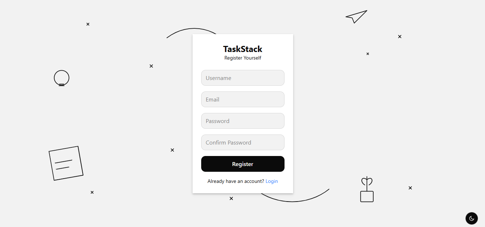
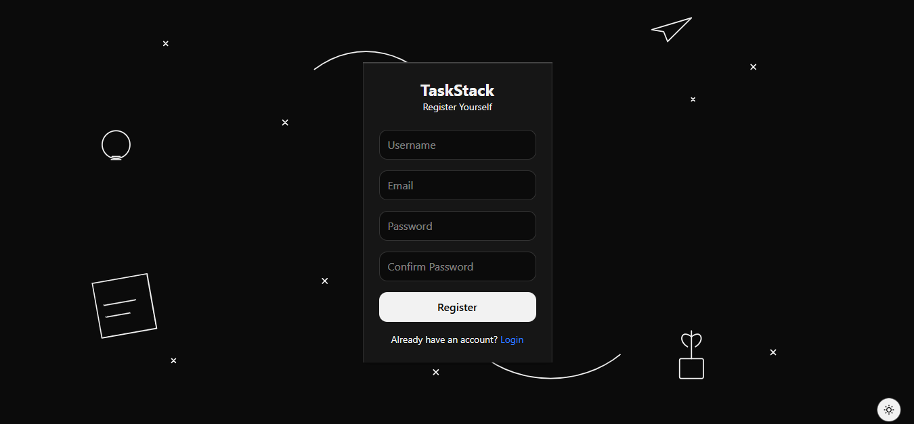
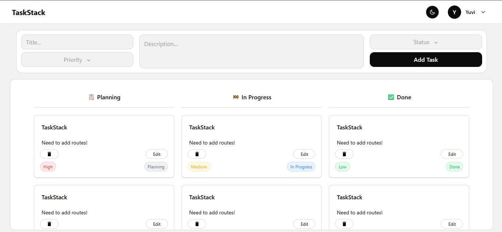
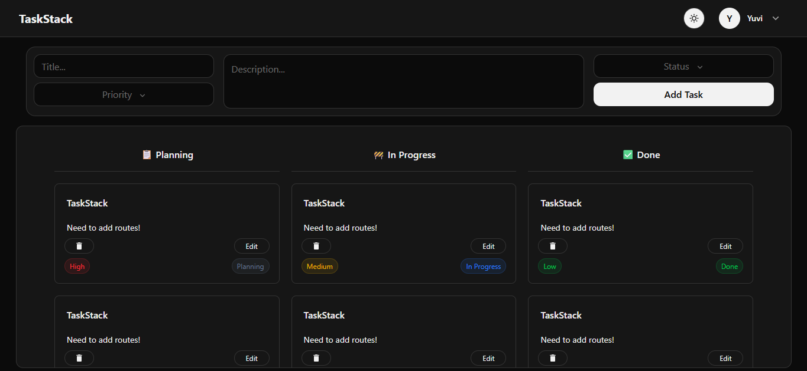
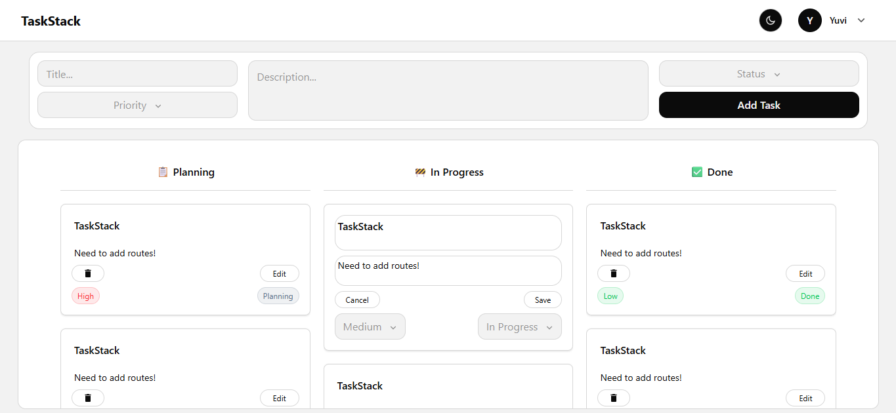
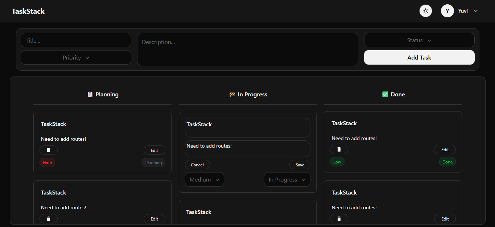

# TaskStack

A Kanban-style task management application built with React, Tailwind CSS, and Supabase.

TaskStack helps users organize their workflow through a simple and intuitive task board. Users can create tasks, track progress, and manage work efficiently with a clean and responsive interface.

## Live Demo

https://taskstack-app.vercel.app

## Features

- User authentication with Supabase
- Create, edit, and delete tasks
- Drag-and-drop task workflow
- Planning, In Progress, and Done task stages
- Protected routes for authenticated users
- Dark and light theme support
- Responsive design for desktop and mobile
- User-specific task management

## Tech Stack

### Frontend

- React
- Vite
- React Router
- Tailwind CSS

### Backend & Database

- Supabase Authentication
- Supabase Database

## Screenshots

### Landing Page





### Login





### Register





### Task Board





### Edit Task





## Installation

Clone the repository:

```bash
git clone https://github.com/yuvrajk-dev/taskstack.git
cd taskstack
```

Install dependencies:

```bash
npm install
```

Create a `.env.local` file:

```env
VITE_SUPABASE_URL
VITE_SUPABASE_PUBLISHABLE_KEY
```

Start the development server:

```bash
npm run dev
```

## Build for Production

```bash
npm run build
```

## Why I Built This

TaskStack was built to strengthen my understanding of modern frontend development concepts, including authentication, route protection, state management, reusable components, responsive design, and backend integration with Supabase.

## Future Improvements

- Task search and filtering
- Due dates and reminders
- Task categories and labels
- Team collaboration
- Activity history

## Author

**Yuvraj Kumar**

GitHub: https://github.com/yuvrajk-dev

LinkedIn: https://linkedin.com/in/yuvrajkumar01
